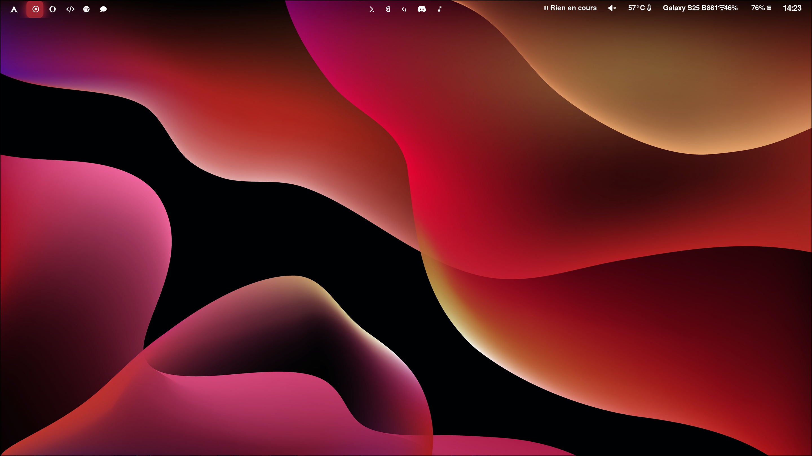

<h1 align="center">❄️ dotfiles-hyprland</h1>

<p align="center">
  Minimal Hyprland dotfiles focused on a clean, fast and keyboard-driven workflow.
</p>

<p align="center">
  
  
  
  
</p>

---

## 🖼️ Preview

<p align="center">
  
  
  
  
</p>

---

## 🧩 Components

- **Window Manager**: Hyprland  
- **Status Bar**: Waybar  
- **Terminal**: Kitty  
- **Launcher**: Wofi  
- **Notifications**: SwayNC  

---

## ✨ Features

- Minimal and distraction-free UI  
- Keyboard-oriented workflow  
- Lightweight and fast configuration  
- Custom scripts for system control  
- Clean and portable paths (`$HOME` based)

---

## 📁 Repository Structure

```text
hypr/        → Hyprland configuration
waybar/     → Waybar config and styling
kitty/      → Kitty terminal configuration
wofi/       → Application launcher config
swaync/     → Notification daemon config
scripts/    → Custom shell scripts
wallpapers/ → Wallpapers
screenshots/→ Desktop previews
